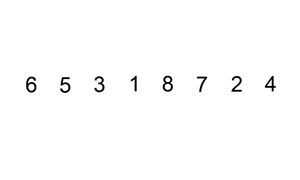

# 147. Insertion Sort List

## problem description

Sort a linked list using insertion sort.



A graphical example of insertion sort. The partial sorted list \(black\) initially contains only the first element in the list. With each iteration one element \(red\) is removed from the input data and inserted in-place into the sorted list

Algorithm of Insertion Sort:

* Insertion sort iterates, consuming one input element each repetition, and growing a sorted output list.
* At each iteration, insertion sort removes one element from the input data, finds the location it belongs within the sorted list, and inserts it there.
* It repeats until no input elements remain.

**Example 1:**

```text
Input: 4->2->1->3
Output: 1->2->3->4
```

**Example 2:**

```text
Input: -1->5->3->4->0
Output: -1->0->3->4->5
```

## problem description

看似简单的链表插入排序，但是实现起来确实需要注意很多细节问题。提一个代码中最重要的点就是，尾指针下一个如果比他大，就不需要插入，这时候尾指针需要后移一位。但是如果比他小，就不需要移动，因为下一位插入到前面去了，新的下一位就接在尾指针后面

## code

```cpp
/**
 * Definition for singly-linked list.
 * struct ListNode {
 *     int val;
 *     ListNode *next;
 *     ListNode(int x) : val(x), next(NULL) {}
 * };
 */
class Solution {
public:
    ListNode* insertionSortList(ListNode* head) {
        ListNode* dummy = new ListNode(0);
        dummy -> next = head;
        ListNode *pre = dummy, *cur = head;
        while (cur) {
            if ((cur -> next) && (cur -> next -> val < cur -> val)) {
                while ((pre -> next) && (pre -> next -> val < cur -> next -> val)) {
                    pre = pre -> next;
                }
                ListNode* temp = pre -> next;
                pre -> next = cur -> next;
                cur -> next = cur -> next -> next;
                pre -> next -> next = temp;
                pre = dummy;
            }
            else {
                cur = cur -> next;
            }
        }
        return dummy -> next;
    }
};
```

## algorithm analysis

插入排序时间复杂度是O\(n²\)，两个循环，每个执行n次，循环中操作是O\(1\)的。

