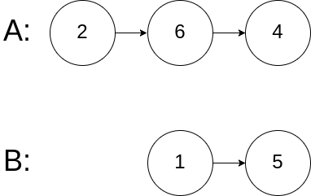

# 160. Intersection of Two Linked Lists

## problem description

Write a program to find the node at which the intersection of two singly linked lists begins.

For example, the following two linked lists:


begin to intersect at node c1.

**Example 1:**


```text
Input: intersectVal = 8, listA = [4,1,8,4,5], listB = [5,0,1,8,4,5], skipA = 2, skipB = 3
Output: Reference of the node with value = 8
Input Explanation: The intersected node's value is 8 (note that this must not be 0 if the two lists intersect). From the head of A, it reads as [4,1,8,4,5]. From the head of B, it reads as [5,0,1,8,4,5]. There are 2 nodes before the intersected node in A; There are 3 nodes before the intersected node in B.
```

**Example 2:**


```text
Input: intersectVal = 2, listA = [0,9,1,2,4], listB = [3,2,4], skipA = 3, skipB = 1
Output: Reference of the node with value = 2
Input Explanation: The intersected node's value is 2 (note that this must not be 0 if the two lists intersect). From the head of A, it reads as [0,9,1,2,4]. From the head of B, it reads as [3,2,4]. There are 3 nodes before the intersected node in A; There are 1 node before the intersected node in B.
```

**Example 3:**



```
Input: intersectVal = 0, listA = [2,6,4], listB = [1,5], skipA = 3, skipB = 2
Output: null
Input Explanation: From the head of A, it reads as [2,6,4]. From the head of B, it reads as [1,5]. Since the two lists do not intersect, intersectVal must be 0, while skipA and skipB can be arbitrary values.
Explanation: The two lists do not intersect, so return null.
```

Notes:

If the two linked lists have no intersection at all, return null.
The linked lists must retain their original structure after the function returns.
You may assume there are no cycles anywhere in the entire linked structure.
Your code should preferably run in O(n) time and use only O(1) memory.


## algorithm thought

这里如果使用一个hashmap保存所有节点，很简单就能得到答案，但是空间复杂度是O(n)，这里要求使用O(1)的空间复杂度解题，首先我们遍历两个链表，得到两个链表的长度，如果有一个长一个短，首先让长的链表头节点先移动两链表的差值，这时候两个链表一样长了，只需要一起移动，并且每次都判断是否为同一个节点即可。

update:更新图片的时候，发现discuss有更好的算法，我这里需要3次遍历链表，其实开始两次得到链表长度的目的就是让两个链表能同步开头，最后一起结束，还有一种办法能达到这个目的。两个链表一起移动，到达尾节点的时候，两个链表交换继续执行。也就是A到尾节点的时候，领tmpA=HeadB，B到尾节点的时候，令tmpB=HeadA。这样，也能消除两个链表之间的差距

## code

```c++
/**
 * Definition for singly-linked list.
 * struct ListNode {
 *     int val;
 *     ListNode *next;
 *     ListNode(int x) : val(x), next(NULL) {}
 * };
 */
class Solution {
public:
    ListNode *getIntersectionNode(ListNode *headA, ListNode *headB) {
        int len1=0,len2=0;
        ListNode*a=headA,*b=headB;
        while(headA){
            len1++;
            headA=headA->next;
        }
        while(headB){
            len2++;
            headB=headB->next;
        }
        if(len1<len2){
            swap(len1,len2);
            swap(a,b);
        }
        int dif=len1-len2;
        //cout<<len1<<' '<<len2<<' '<<dif;
        while(dif--){
            a=a->next;
        }
        while(a!=b){
            a=a->next;
            b=b->next;
        }
        return a;
    }
};

//update code
class Solution {
public:
    ListNode *getIntersectionNode(ListNode *headA, ListNode *headB) {
        ListNode *p1 = headA;
        ListNode *p2 = headB;
        
        if (p1 == NULL || p2 == NULL) return NULL;

        while (p1 != NULL && p2 != NULL && p1 != p2) {
            p1 = p1->next;
            p2 = p2->next;

            //
            // Any time they collide or reach end together without colliding 
            // then return any one of the pointers.
            //
            if (p1 == p2) return p1;

            //
            // If one of them reaches the end earlier then reuse it 
            // by moving it to the beginning of other list.
            // Once both of them go through reassigning, 
            // they will be equidistant from the collision point.
            //
            if (p1 == NULL) p1 = headB;
            if (p2 == NULL) p2 = headA;
        }        
        return p1;
    }
};

```

## algorithm analysis

遍历了很多次链表，时间复杂度是O(n)，没有用额外的空间，空间复杂度O(1)