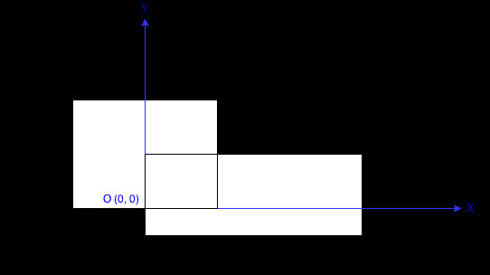

# 223. Rectangle Area

## problem description

Find the total area covered by two rectilinear rectangles in a 2D plane.



Each rectangle is defined by its bottom left corner and top right corner as shown in the figure.

Rectangle Area

**Example:**

```text
Input: A = -3, B = 0, C = 3, D = 4, E = 0, F = -1, G = 9, H = 2
Output: 45
Note:

Assume that the total area is never beyond the maximum possible value of int.
```

## algorithm thought

求出两个矩形的覆盖面积，实质是求出他们的公共面积，然后用两个矩形的总面积减去公共面积即可。

用两个点定义矩形，左下角和右上角。只需要得到A和E以及B和F中的最大值，将得到的两个值作为公共面积的左下角。同理对于右上角两个点，采用取最小值的办法。就能得到公共矩形，之前还需要判断公共矩形是否合法

## code

```c++
class Solution {
public:
    int computeArea(int A, int B, int C, int D, int E, int F, int G, int H) {
        long long all = (long long)(C-A)*(D-B)+(long long)(G-E)*(H-F);
        int I = max(A,E);
        int J = max(B,F);
        int K = min(C,G);
        int L = min(D,H);
        long long cover = 0;
        if(K<=I||L<=J)
            cover = 0;
        else
            cover = (long long)(K-I)*(L-J);
        return all-cover;
    }
};
```

## algorithm analysis

这个算法中所有的操作都是O(1)的，总的时间复杂度是O(1)