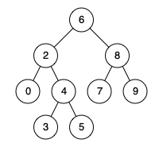

# 235. Lowest Common Ancestor of a Binary Search Tree

## problem description

Given a binary search tree (BST), find the lowest common ancestor (LCA) of two given nodes in the BST.

According to the definition of LCA on Wikipedia: “The lowest common ancestor is defined between two nodes p and q as the lowest node in T that has both p and q as descendants (where we allow a node to be a descendant of itself).”

Given binary search tree:  root = [6,2,8,0,4,7,9,null,null,3,5]
 


**Example 1:**

```text
Input: root = [6,2,8,0,4,7,9,null,null,3,5], p = 2, q = 8
Output: 6
Explanation: The LCA of nodes 2 and 8 is 6.
```

**Example 2:**

```text
Input: root = [6,2,8,0,4,7,9,null,null,3,5], p = 2, q = 4
Output: 2
Explanation: The LCA of nodes 2 and 4 is 2, since a node can be a descendant of itself according to the LCA definition.
```

**Note:**

All of the nodes' values will be unique.
p and q are different and both values will exist in the BST.

## algorithm thought

得到最小公共祖先，对于BST来说不是很难，毕竟BST是有自己的“顺序”的，如果当前节点的值在给定的两个节点之间，直接可以返回当前节点。因为小的那个肯定在左子树，大的肯定在右子树

## code

```c++
/**
 * Definition for a binary tree node.
 * struct TreeNode {
 *     int val;
 *     TreeNode *left;
 *     TreeNode *right;
 *     TreeNode(int x) : val(x), left(NULL), right(NULL) {}
 * };
 */
class Solution {
public:
    TreeNode* lowestCommonAncestor(TreeNode* root, TreeNode* p, TreeNode* q) {
        int ma=max(p->val,q->val);
        int mi=min(p->val,q->val);
        while(root){
            if(root->val<mi){
                root=root->right;
            }else if(root->val>ma){
                root=root->left;
            }else{
                break;
            }
        }
        return root;
    }
};
```

## algorithm analysis

这里最差情况下，时间复杂度是O(lgn),最坏情况就是在最底层的叶子节点才找到最小公共祖先。