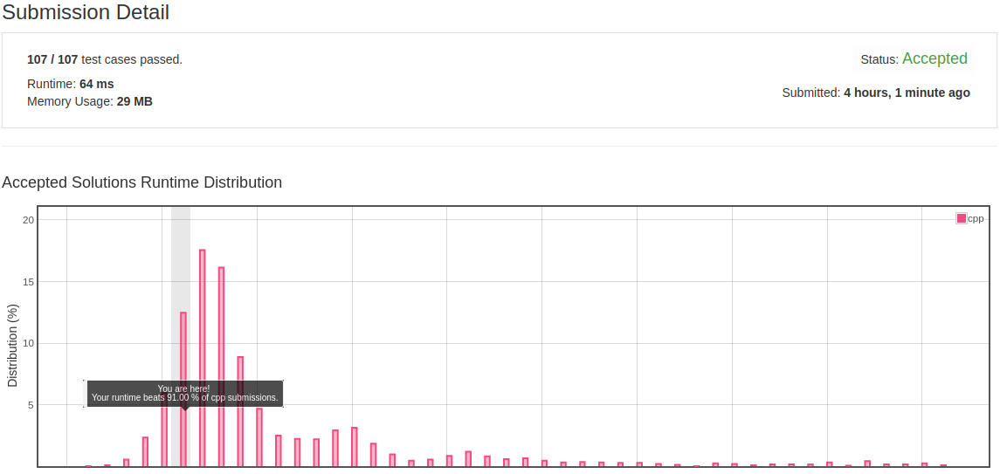

# 654. Maximum Binary Tree

## question description

Given an integer array with no duplicates. A maximum tree building on this array is defined as follow:

1. The root is the maximum number in the array.
2. The left subtree is the maximum tree constructed from left part subarray divided by the maximum number.
3. The right subtree is the maximum tree constructed from right part subarray divided by the maximum number.

Construct the maximum tree by the given array and output the root node of this tree.

## algorithm thought

 碰到树以及链表的题，首先观察返回值，如果返回值是一个TreeNode\*,也就是一个根节点。那基本上可以用递归解决。这里首先用递归的思想去想是否可行，首先便利数组找到最大值作为根节点。根节点左边的数组变成左子树，右边为右子树。对于左右子树，使用一样的解法就能得到答案。递归思想一相同，之后就问题不大了

## code

```text
class Solution {
public:
    TreeNode* constructMaximumBinaryTree(vector<int>& nums) {
        return help(nums,0,nums.size()-1);    
    }
    TreeNode* help(vector<int>&nums,int left,int right){
        if(left>right)
            return NULL;
        if(left==right){
            TreeNode* res=new TreeNode(nums[left]);
            return res;
        }
        int ma=left;
        for(int i=left+1;i<=right;++i){
            ma=nums[ma]>nums[i]?ma:i;
        }
        TreeNode* res=new TreeNode(nums[ma]);
        res->left=help(nums,left,ma-1);
        res->right=help(nums,ma+1,right);
        return res;
    }
};
```

## algorithm analysis

这个时间复杂度不是很好分析，但是在leetcode中运行时间也很快了，贴个图。



